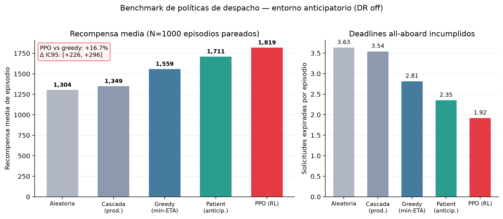

# City2Cruise — Logística portuaria dirigida por RL

[](https://github.com/luis-guillen/city2cruise/actions/workflows/ci.yml)
[](https://github.com/luis-guillen/city2cruise/actions/workflows/ai-rl-ci.yml)
[](LICENSE)

🇬🇧 [English version](README.md) · 📄 [Model Card](docs/MODEL_CARD.md) · 🏗️ [Arquitectura](docs/ARCHITECTURE.md) · 🤖 [RL en detalle](rl_service/README.md)

> Un **agente de aprendizaje por refuerzo** que asigna conductores a recogidas de equipaje
> de cruceristas y **supera a la heurística de producción (vecino más cercano por ETA) en
> un +16,7 %** (y a una heurística anticipatoria hecha a mano en +6,3 %) — servido tras un
> **ciclo de vida MLOps completo** (registro de modelos, gate de promoción, monitorización
> de deriva, CI/CD/CT) alineado con el **Reglamento UE 2024/1689 de IA**.

City2Cruise es una plataforma end-to-end de logística portuaria (hub "Shop & Drop"): los
cruceristas depositan sus compras en lockers inteligentes del puerto antes del all-aboard,
mientras un agente PPO decide qué conductor sirve cada recogida. Escenario principal:
**Las Palmas de Gran Canaria**, con un escenario de pico en Barcelona.

**Qué le interesa a cada revisor:**
- **ML / RL** → un MDP de despacho rediseñado desde los fundamentos; agente entrenado con clonación de comportamiento + PPO que bate a todas las líneas base, con benchmarks de semillas pareadas e intervalos de confianza por bootstrap.
- **MLOps** → registro de modelos con gate de promoción gobernado, tracking MLflow, deriva PSI/KS, pipeline de entrenamiento continuo, observabilidad Prometheus/Grafana del modelo y mapeo al Reglamento UE de IA.
- **Full-stack / producto** → un sistema real: SPA React 18, Node/Express + Socket.IO, geodispatch con PostGIS, cadena de custodia permisionada, gemelo digital FastAPI y arranque con un único comando Docker Compose.

## El agente RL

**Fase 1 — el hallazgo.** El primer entorno planteaba el despacho como un problema miope de
un solo paso. El agente convergía pero no batía al greedy: en esa formulación **el greedy es
óptimo por construcción** (la solicitud objetivo es siempre la más urgente, así que lo único
que controla la acción es el ETA del conductor, que el greedy minimiza). Reportarlo con
honestidad y diagnosticar *por qué* motivó el rediseño.

**Fase 2 — el rediseño.** Se reformuló el entorno como un semi-MDP dirigido por eventos donde
anticipar sí compensa: las solicitudes llegan en **olas de crucero**, los conductores quedan
**ocupados** tras cada asignación, las recogidas tienen **deadlines all-aboard duros**, y el
agente puede hacer una **espera estratégica**. Entrenado con **clonación de comportamiento +
fine-tuning PPO**, ahora bate a todas las líneas base.

**Resultados** (1000 episodios pareados held-out):



| Política | Recompensa media | Deadlines perdidos / episodio |
|---|---:|---:|
| **PPO (RL)** | **1819,4** | **1,92** |
| Patient (heurística anticipatoria) | 1711,2 | 2,35 |
| Greedy (vecino más cercano) | 1558,6 | 2,81 |
| Cascade (proxy heurística producción) | 1349,1 | 3,54 |
| Aleatoria | 1303,5 | 3,63 |

**+16,7 % sobre greedy** (IC95 bootstrap del delta pareado: [+226, +296]), **+6,3 % sobre la
heurística anticipatoria** y **31,7 % menos deadlines incumplidos**. Método completo y
reproducción: **[rl_service/README.md](rl_service/README.md)**.

## Arranque rápido

```bash
git clone https://github.com/luis-guillen/city2cruise.git
cd city2cruise
cp envs/dev.env.example backend/.env          # secretos demo incluidos
docker compose -f docker-compose.dev.yml up --build
```

Login demo: `admin@test.com` / `password123` → **Torre de Control** → selecciona una
solicitud para ver al agente PPO rankear conductores en tiempo real.

Para probar el agente aislado (sin backend/DB, checkpoint horneado):

```bash
docker build -t city2cruise-rl ./rl_service && docker run -p 8080:8080 city2cruise-rl
# → Swagger interactivo en http://localhost:8080/docs  (POST /assign)
```

## Documentación

| Tema | Ubicación |
|---|---|
| **Model card** (métricas, limitaciones, EU AI Act) | [`docs/MODEL_CARD.md`](docs/MODEL_CARD.md) |
| **Arquitectura** (one-pager) | [`docs/ARCHITECTURE.md`](docs/ARCHITECTURE.md) |
| **Agente RL** en detalle + reproducción | [`rl_service/README.md`](rl_service/README.md) |
| API backend | [`backend/README.md`](backend/README.md) |
| Figuras de resultados (regenerables) | [`docs/figures/`](docs/figures/) · `python scripts/plot_tfm_figures.py` |

## Licencia

[MIT](LICENSE) © Luis Guillén Servera. Proyecto de TFM del Máster en IA (UNIR).
