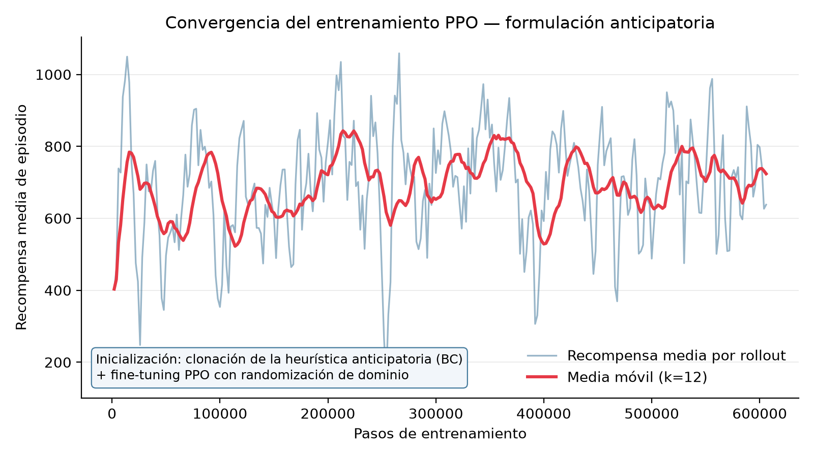
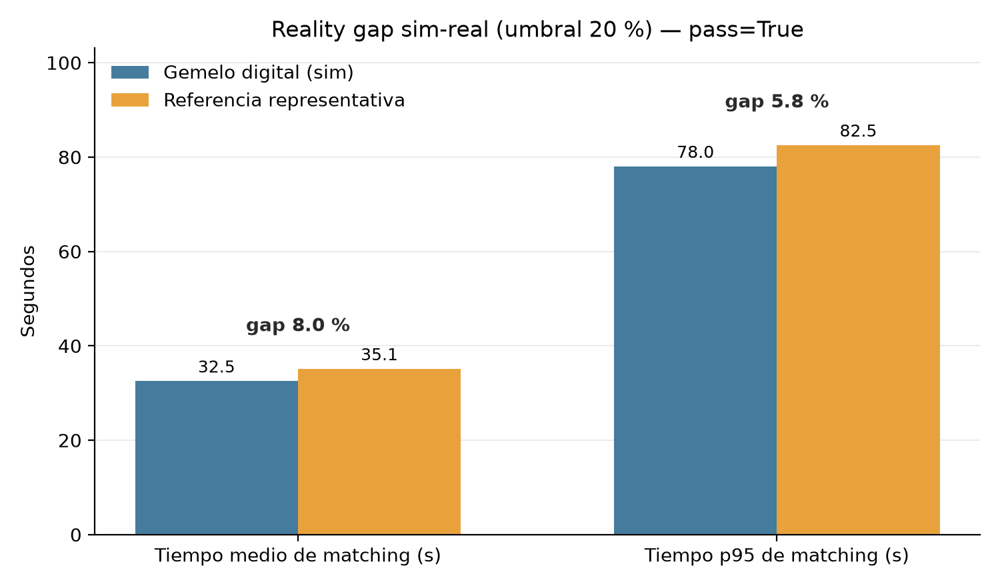
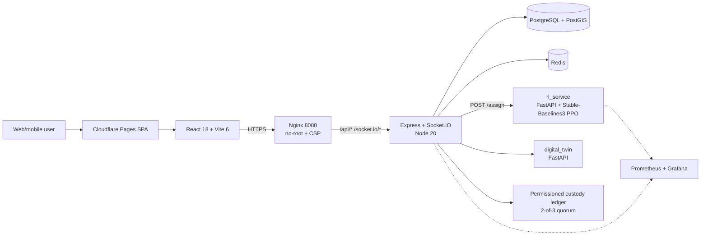

# City2Cruise — RL-Driven Port Logistics

[](https://github.com/luis-guillen/city2cruise/actions/workflows/ci.yml)
[](https://github.com/luis-guillen/city2cruise/actions/workflows/ai-rl-ci.yml)
[](https://conventionalcommits.org)
[](LICENSE)

🇪🇸 [Versión en español](README.es.md) · 📄 [Model Card](docs/MODEL_CARD.md) · 🏗️ [Architecture](docs/ARCHITECTURE.md) · 🤖 [RL deep-dive](rl_service/README.md)

> A **reinforcement-learning dispatch agent** that assigns drivers to cruise-passenger
> luggage pickups, **beating the production nearest-ETA heuristic by +16.7 %** (and a
> hand-crafted anticipatory heuristic by +6.3 %) — served behind a **complete MLOps
> lifecycle** (model registry, promotion gate, drift monitoring, CI/CD/CT) aligned with
> the **EU AI Act (Reg. 2024/1689)**.

City2Cruise is an end-to-end port-logistics platform (a "Shop & Drop" hub): cruise
passengers drop city purchases at smart lockers near the port before all-aboard, while a
PPO agent decides which driver serves each pickup. Primary scenario: **Las Palmas de Gran
Canaria**, with a Barcelona peak-demand scenario.

**What each reviewer will care about:**
- **ML / RL** → a dispatch MDP redesigned from first principles (§ [The RL agent](#the-rl-agent)); an agent trained with behaviour cloning + PPO that provably beats every baseline, with paired-seed benchmarks and bootstrap confidence intervals.
- **MLOps** → model registry with a governed promotion gate, MLflow tracking, PSI/KS drift detection, a continuous-training pipeline, Prometheus/Grafana model observability, and an EU AI Act mapping.
- **Full-stack / product** → a real system: React 18 SPA, Node/Express + Socket.IO, PostGIS geodispatch, a permissioned custody ledger, a FastAPI digital twin, and Docker-Compose one-command bring-up.

---

## The RL agent

The signature contribution — and the most interesting engineering story.

**Phase 1 — the finding.** The first environment framed dispatch as a myopic one-step
problem. The agent converged but never beat the greedy nearest-ETA baseline. That was not
a bug: in that formulation **greedy is optimal by construction** — the target request is
always the most urgent one, so the only quantity the action controls is the chosen
driver's ETA, which greedy minimises. Reporting that honestly, and diagnosing *why*, is
what motivated the redesign.

**Phase 2 — the redesign.** The environment was reformulated as an event-driven semi-MDP
where anticipation actually pays: requests arrive over time in **cruise waves**, drivers
become **busy** after each assignment (resource contention), pickups carry **hard
all-aboard deadlines**, and the agent can make a **strategic wait** (hold for a
soon-to-free nearby driver instead of dispatching a distant one). Trained with
**behaviour cloning + PPO fine-tuning**, the agent now beats every baseline.

**Results** (1000 paired-seed held-out episodes; higher reward = better service quality):


| Policy | Mean reward | Missed deadlines / episode |
|---|---:|---:|
| **PPO (RL)** | **1819.4** | **1.92** |
| Patient (anticipatory heuristic) | 1711.2 | 2.35 |
| Greedy (nearest-ETA, idealised) | 1558.6 | 2.81 |
| Cascade (production heuristic proxy) | 1349.1 | 3.54 |
| Random | 1303.5 | 3.63 |

**+16.7 % over greedy** (bootstrap 95 % CI of the paired delta: [+226, +296], well clear
of zero), **+6.3 % over the hand-crafted anticipatory heuristic**, and **31.7 % fewer
missed all-aboard deadlines**. Full method, hyperparameters and reproduction steps:
**[rl_service/README.md](rl_service/README.md)**.

<p align="center">
  
  
</p>

## MLOps lifecycle

The agent is not a notebook artifact — it ships behind a full lifecycle:

- **Reproducible training** — fixed seed, pinned deps, domain randomization; every run
  logged to **MLflow** + TensorBoard with full model lineage.
- **Model registry + governed promotion** — `candidate → staging → production` with an
  auto-generated model card. A model is promoted **only if** it converges, passes fidelity
  and robustness, beats random, and **surpasses greedy by ≥ 5 %** (`surpasses_greedy`).
- **CI/CD/CT** — training, validation and registration workflows, plus a continuous-training
  pipeline that retrains on drift.
- **Observability + drift** — Prometheus metrics and Grafana dashboards for the model, an
  auditable `rl_inference_log`, and PSI (data) + KS/MAPE (concept) drift detection.
- **EU AI Act (Reg. 2024/1689)** — prediction logging (Art. 12), human oversight (Art. 14),
  accuracy/robustness (Art. 15), quality management + technical documentation (Art. 17, Annex IV).

## Architecture



Detailed diagram: [`docs/architecture.mmd`](docs/architecture.mmd) · full narrative:
[`docs/ARCHITECTURE.md`](docs/ARCHITECTURE.md).

## Quickstart

The whole stack comes up with one command (the backend auto-seeds demo data):

```bash
git clone https://github.com/luis-guillen/city2cruise.git
cd city2cruise
cp envs/dev.env.example backend/.env          # demo secrets included
docker compose -f docker-compose.dev.yml up --build
```

Then open the frontend and log in with the seeded demo account (`admin@test.com` /
`password123`) → **Control Tower** → select a pickup request to watch the PPO agent rank
drivers in real time.

**Try the AI agent in isolation** (no DB/backend needed — the checkpoint is baked in):

```bash
docker build -t city2cruise-rl ./rl_service
docker run -p 8080:8080 city2cruise-rl
# → interactive Swagger UI at http://localhost:8080/docs  (POST /assign)
```

## Repository structure

```
.
├── backend/          # Express + Socket.IO + PostgreSQL/PostGIS (TypeScript)
├── cruise-connect-main/  # React 18 + Vite 6 SPA (Control Tower, dashboards)
├── rl_service/       # FastAPI + Stable-Baselines3 PPO — the RL agent + MLOps
├── digital_twin/     # FastAPI operational simulation
├── validator/        # Permissioned custody-ledger validator nodes
├── observability/    # Prometheus scrape config, Grafana dashboards, alert rules
├── deploy/ · terraform/  # Fly.io / Neon / Upstash / Cloudflare IaC
├── scripts/          # training, drift report, CT pipeline, figure generation
└── docs/             # model card, architecture, results, ADRs
```

## Tech stack

- **ML / RL** — Python 3.11, Stable-Baselines3 (PPO), Gymnasium, MLflow, Prometheus client, FastAPI.
- **Backend** — Node 20, Express, Socket.IO, TypeScript (strict), Zod, PostgreSQL 15 + PostGIS, Redis 7.
- **Frontend** — React 18, Vite 6, TypeScript, Tailwind, shadcn/ui, Leaflet, Recharts.
- **Infra / DevSecOps** — Docker, Fly.io, Neon, Upstash, Cloudflare Pages, Terraform, GitHub Actions, SBOM + Trivy + cosign, Dependabot, gitleaks.

## Documentation

| Topic | Location |
|---|---|
| **Model card** (metrics, limitations, EU AI Act) | [`docs/MODEL_CARD.md`](docs/MODEL_CARD.md) |
| **Architecture** one-pager | [`docs/ARCHITECTURE.md`](docs/ARCHITECTURE.md) |
| **RL agent** deep-dive + reproduction | [`rl_service/README.md`](rl_service/README.md) |
| Backend API reference | [`backend/README.md`](backend/README.md) |
| Frontend | [`cruise-connect-main/README.md`](cruise-connect-main/README.md) |
| Result figures (regenerable) | [`docs/figures/`](docs/figures/) · `python scripts/plot_tfm_figures.py` |
| Engineering history / ADRs | [`docs/`](docs/) |

## License

[MIT](LICENSE) © Luis Guillén Servera. Built as an MSc AI thesis project (UNIR).
