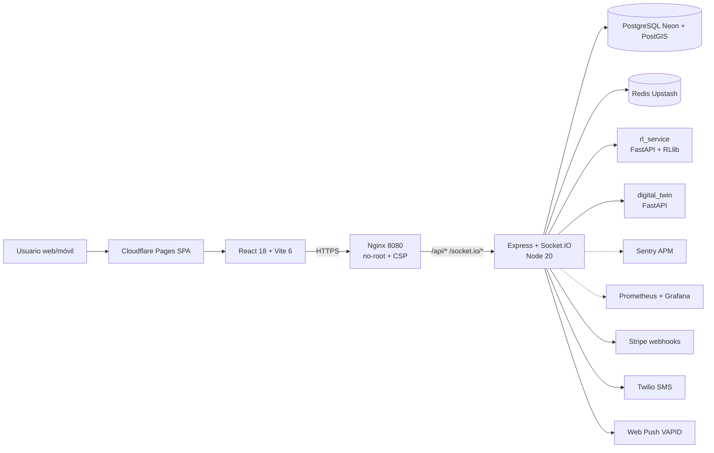

# City2Cruise — Shop & Drop Port Hub

[](https://github.com/pablete64/APP_TRASNPORTE_LOCKERS_BARCELONA/actions/workflows/ci.yml)
[](https://github.com/pablete64/APP_TRASNPORTE_LOCKERS_BARCELONA/actions/workflows/cd.yml)
[](https://conventionalcommits.org)

Plataforma de logística de última milla para cruceristas: el cliente reserva
una recogida, un driver le entrega/recoge el equipaje y se deposita en un
locker del puerto antes del all-aboard.

---

## 1. Visión

Tres roles, un flujo:

- **Cliente**: pide recogida desde su teléfono, sigue al driver en mapa,
  recibe SMS con el `handshake_code`, marca confirmación en el encuentro y
  recoge el `locker_code` para abrir el locker.
- **Driver**: ve solicitudes en cascada por radios (3 → 5 → 7 km), acepta,
  navega, marca confirmación con el cliente, deposita en locker.
- **Admin**: visualiza KPIs, fleet, salud de hardware lockers y cumple
  obligaciones de auditoría.

## 2. Arquitectura



Diagrama detallado: [`docs/architecture.mmd`](docs/architecture.mmd)
(render con `npx @mermaid-js/mermaid-cli -i docs/architecture.mmd -o
docs/architecture.png`).

## 3. Estructura del repositorio

```
.
├── backend/              # Express + Socket.IO + Postgres (TypeScript)
│   ├── src/
│   │   ├── auth/         # JWT, refresh, password policy, RBAC
│   │   ├── routes/       # /api/* endpoints
│   │   ├── sockets/      # Socket.IO + cluster + Redis adapter
│   │   ├── services/     # GeoDispatch, RL, Locker sync, etc.
│   │   ├── schemas/      # Zod schemas — single source of truth
│   │   └── observability/# Sentry, métricas
│   └── Dockerfile        # node:20-alpine, USER node, HEALTHCHECK
├── cruise-connect-main/  # SPA React 18 + Vite 6 + Tailwind + shadcn/ui
│   ├── src/
│   │   ├── pages/        # ClientDashboard, DriverDashboard, AdminDashboard
│   │   ├── hooks/        # useApp, useSocket
│   │   └── observability/# Sentry browser SDK
│   └── Dockerfile        # nginx-unprivileged 8080, USER 101, HEALTHCHECK
├── digital_twin/         # FastAPI — simulación operacional (Python)
├── rl_service/           # FastAPI + RLlib — matching avanzado (Python)
├── deploy/               # Fly.io toml + Cloudflare Pages
├── docker/               # init-test-db.sh
├── envs/                 # plantillas .env por entorno (NO secretos reales)
├── k6/                   # tests de carga
├── observability/        # alert rules, dashboards Grafana
├── scripts/              # helpers: secrets-audit, generate-vapid, …
├── terraform/            # IaC: Fly+Neon+Upstash y AWS
├── .github/
│   ├── workflows/        # ci, cd, e2e, zap-baseline, commitlint, release, …
│   ├── dependabot.yml    # H-4.2 — updates automáticos
│   └── CODEOWNERS
└── docs/                 # documentación (ver § 5)
```

## 4. Quickstart

### Requisitos

- Node 20+
- Python 3.11+
- Docker + Docker Compose
- (Opcional) `pre-commit` (`pip install pre-commit`)

### Arranque local

```bash
# 1. Clonar
git clone https://github.com/pablete64/APP_TRASNPORTE_LOCKERS_BARCELONA.git
cd APP_TRASNPORTE_LOCKERS_BARCELONA

# 2. Instalar hooks pre-commit (gitleaks + secret scan)
pip install pre-commit
./scripts/install-hooks.sh

# 3. Variables de entorno (rellenar con valores propios)
cp envs/development.env.example backend/.env
cp envs/development.env.example cruise-connect-main/.env

# 4. Backend + Postgres + Redis vía docker-compose (perfil dev)
docker compose -f docker-compose.dev.yml up -d

# 5. Frontend en HMR
cd cruise-connect-main && npm install --legacy-peer-deps && npm run dev

# 6. Backend en HMR
cd ../backend && npm install && npm run dev

# 7. Generar VAPID keys (web push)
./scripts/generate-vapid.sh
```

Smoke checks:

```bash
curl http://localhost:9000/api/health     # backend
open http://localhost:9100                # frontend (Vite dev server)
```

### Tests

```bash
# Backend (jest)
cd backend && npm test

# Frontend (vitest + Playwright)
cd cruise-connect-main && npm test                 # vitest
cd cruise-connect-main && npx playwright test      # E2E

# Carga (k6)
k6 run k6/phase4-100c.js

# Audit
cd backend && npm audit --audit-level=high
cd cruise-connect-main && npm audit --audit-level=high
```

## 5. Documentación

| Tema | Ubicación |
| --- | --- |
| Auditoría técnica integral | `AUDITORIA_TECNICA_INTEGRAL_2026-04-29.pdf` |
| Hoja de ruta de remediación (este programa) | `HOJA_DE_RUTA_REMEDIACION_2026-04-29.pdf` |
| Hitos cerrados | `docs/devops/HITO_REMEDIACION_*.md` |
| Índice de hitos | `docs/devops/HITO_REMEDIACION_INDEX.md` |
| ADRs (decisiones arquitectónicas) | `docs/adr/` |
| Runbooks operacionales | `docs/runbooks/` |
| Auditorías post-fix (npm audit, ZAP, Trivy) | `docs/devops/audits/` |
| Política de CVEs | `docs/devops/SECURITY_POLICY.md` |
| Histórico (auditorías y planes superseded) | `docs/history/` |
| Diagrama de arquitectura | `docs/architecture.mmd` |

## 6. Contributing

- Ramas:
  - `main`: production. Protegida — ver
    `docs/devops/HITO_REMEDIACION_H-5.3.md`.
  - `FINAL`: integradora del programa de remediación 2026-04.
  - `fix/H-X.Y-slug`: branches de hito específico.
- **Conventional Commits** obligatorio (`commitlint.config.cjs`).
  Tipos válidos: `feat`, `fix`, `perf`, `refactor`, `docs`, `test`,
  `build`, `ci`, `chore`, `style`, `revert`.
- Cada PR debe pasar el CI completo (lint, tsc, jest/vitest, build,
  `npm audit --audit-level=high`).
- Plantilla de PR: `.github/pull_request_template.md` con campo `Hito:` y
  `Closes #`.
- Code Owners: `.github/CODEOWNERS`.
- Releases: `semantic-release` (`.releaserc.json`) en `main`.

## 7. Stack tecnológico

- **Frontend**: React 18, Vite 6, TypeScript strict, Tailwind, shadcn/ui,
  Leaflet, Recharts, vitest, Playwright.
- **Backend**: Node 20, Express, Socket.IO, TypeScript strict, Zod,
  pino, jest + supertest, ESLint type-checked.
- **Datos**: PostgreSQL 15 + PostGIS, Redis 7.
- **ML / Simulación**: Python 3.11 (FastAPI, RLlib) en `rl_service`,
  FastAPI puro en `digital_twin`.
- **Infra**: Fly.io (apps), Neon (Postgres), Upstash (Redis), Cloudflare
  Pages (SPA), Terraform.
- **DevSecOps**: SBOM CycloneDX, Trivy HIGH/CRITICAL gating, cosign
  keyless OIDC, Dependabot multi-ecosistema, gitleaks pre-commit, ZAP
  baseline nightly, branch protection rule formal.

## 8. Licencia

UNLICENSED — código privado. Consultar al owner antes de cualquier
redistribución.
