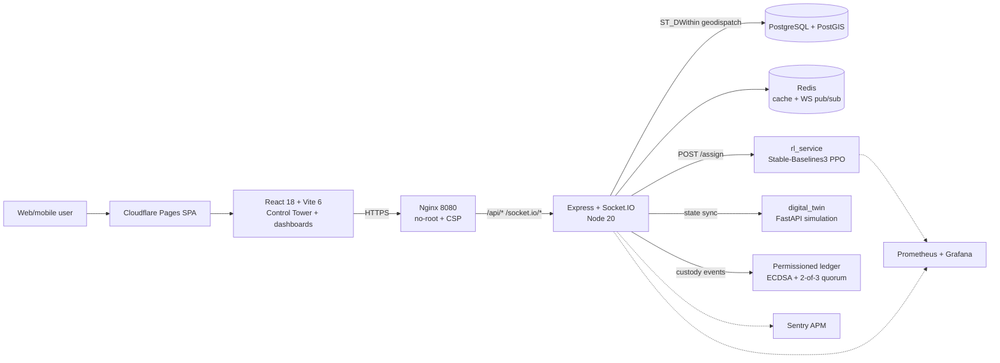

# City2Cruise — Architecture

A two-minute engineering overview. For the RL deep-dive see
[`rl_service/README.md`](../rl_service/README.md); for model metrics and the EU AI Act
mapping see [`MODEL_CARD.md`](MODEL_CARD.md).

## Problem

Cruise passengers have hours ashore but must return before **all-aboard**. City2Cruise lets
them drop city purchases at **smart lockers** near the port and have drivers move the
luggage — a last-mile logistics problem with a hard deadline, spiky demand (a ship disgorges
thousands of passengers at once) and a fleet of limited drivers. The core decision is
**which driver serves which pickup**, and the naive answer (nearest driver) is provably
suboptimal once demand is anticipatory.

## System

**Three integrated axes over one telemetry pipeline:**

1. **RL dispatch** (`rl_service`) — a PPO agent ranks drivers. The backend fuses GPS +
   cruise manifests + IoT locker telemetry into a 69-dim state tensor (`< 200 ms`), posts it
   to `POST /assign`, and applies the ranking (advisory; falls back to geo-distance if the
   model is slow/off via `RL_ROUTING_ENABLED`).
2. **Permissioned custody ledger** (`backend` + `validator`) — an append-only chain with
   ECDSA signatures, HMAC-SHA256 linking and a 2-of-3 validator quorum records the three
   custody events (handshake, deposit, pickup) with cryptographic non-repudiation.
3. **Digital twin** (`digital_twin`) — a FastAPI operational simulation used as a safe
   Sim-to-Real training/validation environment, with domain randomization (Tobin et al., 2017).

## Key decisions

- **RL over a heuristic** — a nearest-ETA heuristic is optimal only in myopic dispatch;
  under cruise-wave demand with deadlines, an anticipatory PPO agent beats it by +16.7 %
  (see [RL README](../rl_service/README.md) for the two-phase diagnosis).
- **Permissioned ledger, not a public blockchain** — millisecond commit latency and zero
  gas cost for a high-frequency port environment, keeping cryptographic auditability.
- **Advisory AI + human-in-the-loop** — the agent ranks, the Control Tower decides, a
  deterministic fallback always exists (EU AI Act Art. 14).
- **Contract-first serving** — the backend posts a structured `StateTensor`; the 69-dim
  encoding is internal to the agent, so the observation can be reformulated without breaking
  the HTTP contract.

## Results

| Metric | Value |
|---|---|
| PPO vs greedy (production heuristic) | **+16.7 %** reward, −31.7 % missed deadlines |
| PPO vs anticipatory heuristic | +6.3 %, 95 % CI [+226, +296] |
| Sim-to-real reality gap (avg / p95) | 8.0 % / 5.8 % (< 20 % gate) |
| Inference latency | < 20 ms |

## MLOps & compliance

Reproducible training (fixed seed, pinned deps) → MLflow tracking → **model registry** with
a **governed promotion gate** (`surpasses_greedy ≥ 1.05`, fidelity, robustness) → CI/CD/CT
workflows → Prometheus/Grafana model observability + PSI/KS **drift** detection →
continuous-training loop. Mapped to **EU AI Act (Reg. 2024/1689)**: Art. 12 (logging),
Art. 14 (oversight), Art. 15 (accuracy/robustness), Art. 17 + Annex IV (quality management).

## Stack

Python 3.11 · Stable-Baselines3 · Gymnasium · MLflow · FastAPI · Node 20 · Express ·
Socket.IO · TypeScript · PostgreSQL 15 + PostGIS · Redis 7 · React 18 · Vite 6 · Docker ·
Fly.io · Terraform · GitHub Actions.
